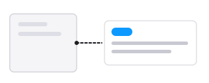
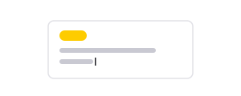
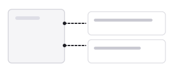
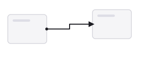
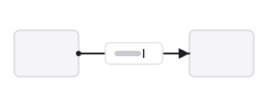
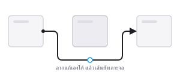
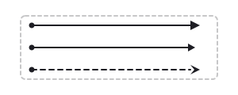

# ANNOCON

ปลั๊กอิน Figma สำหรับใส่โน้ตอธิบาย (**Annotate**) และลากเส้นเชื่อม layer (**Connect**)
แบบที่ผูกติดอยู่กับไฟล์จริง ไม่ใช่ overlay ชั่วคราวที่หายไปตอน export หรือ present —
เปิดไฟล์ที่ไหน เห็นครบทุกคนที่ไหน ไม่ต้องเปิด Dev Mode หรือสลับโหมดดูอะไรเป็นพิเศษ

---

## ทำอะไรได้บ้าง

### Annotate — ใส่โน้ตอธิบายงาน

| | |
|:--|:--|
|  |  |
| **โน้ตที่อยู่บน canvas จริง**<br>ไม่หายตอน export หรือ present ใครเปิดไฟล์ก็เห็น ไม่ต้องเปิด Dev Mode | **แก้ข้อความบน canvas ได้เลย**<br>ดับเบิลคลิกที่การ์ดแล้วพิมพ์ทับ หรือคลิกการ์ดแล้วแก้ในปลั๊กอินก็ได้ |
|  |  |
| **เลือกขนาดได้ หรือลากเอง**<br>Small / Medium / Large หรือลากขอบการ์ด ข้อความไหลตามความกว้างทันที | **วางตำแหน่งให้เอง**<br>หลบออกไปข้างเฟรมไม่ให้ทับงาน และการ์ดหลายใบขยับหนีกันเองไม่ให้ซ้อน |

จัดหมวดหมู่โน้ตด้วยสีได้ด้วย — มีให้ 3 แบบตั้งต้น (Note, Dev, Idea) เพิ่ม แก้ชื่อ เปลี่ยนสี ลบ ได้เอง

### Connect — ลากเส้นเชื่อม layer

| | |
|:--|:--|
|  |  |
| **เส้นที่เกาะ layer จริง**<br>ขยับจอแล้วเส้นตามทันที ไม่ต้องมานั่งลากแก้ทีหลัง | **อ้อมเฟรมที่ขวางทางให้เอง**<br>วางจอคั่นกลางเมื่อไหร่ก็คิดทางใหม่ให้ หรือสั่งทิศทางเองด้วย Go around |
|  |  |
| **ป้ายกำกับที่คลิกแก้ได้**<br>คลิกที่ป้ายบนเส้นแล้วพิมพ์ได้เลย ไม่ต้องหาตัวเส้นก่อน | **ดัดเส้นเองได้**<br>แก้รูปทรงด้วยเครื่องมือ vector ปลั๊กอินไม่คำนวณทับ แต่ยังเลื่อนตาม layer ให้ |
|  | |
| **ปรับแต่งได้ครบ**<br>สี ความหนา opacity รูปแบบเส้น หัว-ท้ายเส้น ทิศทางออก-เข้า | |

จำสไตล์ล่าสุดที่ใช้ให้ด้วย — ตั้งสีเทาไว้ครั้งนี้ เส้นต่อไปก็เริ่มจากสีเทา จำข้ามการเปิด-ปิดปลั๊กอิน

---

## มีอะไรใหม่

ทุกเวอร์ชันเขียนไว้ว่าเปลี่ยนอะไร พร้อมภาพเทียบก่อน-หลัง และไฟล์ให้โหลด —
ดูที่ **[หน้า Releases](https://github.com/sundayfifth/annocon/releases)**

---

## วิธีติดตั้ง

ต้องมี **[Figma desktop app](https://www.figma.com/downloads/)** เท่านั้น — ใช้ผ่านเบราว์เซอร์ไม่ได้

### ลงครั้งแรก

1. โหลด `annocon-plugin.zip` จาก **[หน้า Releases](https://github.com/sundayfifth/annocon/releases/latest)**
2. แตกไฟล์ จะได้โฟลเดอร์ `annocon` วางไว้ที่ไหนก็ได้ที่จะไม่ลบหรือย้ายทีหลัง
3. Figma → **Plugins → Development → Import plugin from manifest…** → เลือก `manifest.json` ในโฟลเดอร์นั้น

> [!NOTE]
> Figma จำ path ที่เลือกไว้ ถ้าย้ายหรือลบโฟลเดอร์ทีหลัง ปลั๊กอินจะเปิดไม่ได้

### อัปเดตเป็นเวอร์ชันใหม่

1. โหลด zip ตัวล่าสุด แตกไฟล์
2. เอาโฟลเดอร์ `annocon` **วางทับโฟลเดอร์เดิม**
3. ปิดปลั๊กอินแล้วเปิดใหม่

ไม่ต้อง import ใหม่ ไม่ต้องลบตัวเก่า และโน้ต หมวดหมู่ เส้นเชื่อม อยู่ครบ

> [!IMPORTANT]
> ต้องวางทับ**ที่เดิม** ถ้าวางที่ใหม่ ปลั๊กอินจะยังรันโค้ดเก่าจาก path เดิมโดยไม่มีอะไรเตือน
> (แก้ได้โดย import จาก path ใหม่ แล้วลบตัวเก่าทาง **Plugins → Development → Manage plugins…**)

<details>
<summary><b>build เอง (สำหรับคนที่จะแก้โค้ดต่อ)</b></summary>

ต้องมี [Node.js](https://nodejs.org) 22 ขึ้นไป

```bash
git clone https://github.com/sundayfifth/annocon.git
cd annocon
npm install
npm run build
```

แล้ว import `manifest.json` ที่ถูกสร้างในโฟลเดอร์นี้ ระหว่างพัฒนาใช้ `npm run watch` ให้ build
ใหม่อัตโนมัติทุกครั้งที่แก้โค้ด แล้วรันปลั๊กอินใหม่ในหน้า Figma เพื่อดึงโค้ดล่าสุด

</details>

---

## วิธีใช้งาน

เปิดจาก **Plugins → Development → ANNOCON → Annotate & Connect** แล้วทำอันไหนก่อนก็ได้

### ใส่โน้ต

เลือก layer → พิมพ์โน้ตในแท็บ Annotate → เลือกหมวดหมู่ (ถ้าต้องการ) → คลิกออกจากช่อง
การ์ดจะขึ้นบน canvas ทันที

**แก้ทีหลัง** — คลิกที่การ์ดได้เลย ปลั๊กอินจะเปิดโน้ตนั้นให้ หรือดับเบิลคลิกแล้วพิมพ์ทับตรงนั้น
ปรับขนาดด้วยปุ่ม Small / Medium / Large หรือลากขอบการ์ดเอง

### ลากเส้นเชื่อม

เลือก layer 2 อัน (คลิกอันแรก แล้ว Shift-คลิกอันที่สอง) เส้นจะถูกสร้างให้เอง แล้วเด้งไปแท็บ
Connect ให้ปรับสไตล์

**แก้ทีหลัง** — คลิกที่เส้น หรือคลิกที่ป้ายกำกับบนเส้นก็ได้

**ดัดเส้นเอง** — ดับเบิลคลิกเส้นแล้วแก้รูปทรงด้วยเครื่องมือ vector ได้ตามใจ จากนั้นปลั๊กอินจะไม่
คำนวณเส้นทางทับ แต่ยังเลื่อนเส้นตาม layer ให้อยู่ ถ้าเปลี่ยนใจกด **กลับไปใช้เส้นอัตโนมัติ** ในแท็บ Connect

### จัดการหมวดหมู่

แท็บ Categories — เพิ่ม แก้ชื่อ เปลี่ยนสี ลบ

---

## ข้อควรระวัง

**ปลั๊กอินต้องเปิดค้างไว้ ระบบถึงจะทำงานแบบ real-time** เป็นข้อจำกัดของ Figma เอง ไม่ใช่แค่
ปลั๊กอินนี้ — โค้ดจะหยุดทำงานทันทีที่ปิดหน้าต่าง (ไม่ได้โฟกัสอยู่ไม่เป็นไร ขอแค่ยังเปิด)

ผลคือ:

- **ขยับ layer ตอนปิดปลั๊กอิน** — เส้นกับการ์ดจะค้างที่เดิมชั่วคราว ไม่ได้พัง เปิดปลั๊กอินใหม่
  แล้วมันจัดให้เอง หรือคลิกขวาบน canvas → **Plugins → ANNOCON → Re-sync this page**
  ก็ได้ ไม่ต้องเปิดหน้าต่าง
- **ลบการ์ดโน้ตตอนปิดปลั๊กอิน** — ข้อมูลที่ผูกไว้จะถูกเคลียร์ตอน sync รอบหน้า ไม่ต้องทำอะไรเพิ่ม
- **ลบเส้นเชื่อม** — ลบได้ทันทีเสมอ ไม่ว่าปลั๊กอินจะเปิดหรือปิด เพราะข้อมูลอยู่ในตัวเส้นเอง

---

## คำถามที่พบบ่อย

<details>
<summary><b>หาปลั๊กอินในเมนู Plugins ไม่เจอ</b></summary>

ต้องดูที่ **Plugins → Development → ANNOCON** ไม่ใช่เมนู Plugins ธรรมดาที่โชว์ปลั๊กอินจาก
Community ถ้ายังไม่เจอในเมนู Development แปลว่ายังไม่ได้ import ย้อนไปทำตาม
[วิธีติดตั้ง](#วิธีติดตั้ง)

</details>

<details>
<summary><b>จะลบปลั๊กอินออกยังไง</b></summary>

**Plugins → Development → Manage plugins…** → ลบ ANNOCON ออกจากลิสต์ แล้วจะลบโฟลเดอร์
ที่แตก zip ไว้ด้วยก็ได้

</details>

<details>
<summary><b>ใช้กับไฟล์ FigJam ได้ไหม</b></summary>

ไม่ได้ — รองรับเฉพาะไฟล์ Design

</details>

<details>
<summary><b>ทำไมไม่มีในหน้า Figma Community</b></summary>

ยังไม่ได้เผยแพร่ ต้อง import เองผ่านเมนู Development ตามขั้นตอนข้างบน

</details>

---

## เอกสารเพิ่มเติม

- `docs/adr/` — บันทึกการตัดสินใจด้านสถาปัตยกรรม
- `docs/spikes.md` — คำถามเปิดที่เอกสาร Figma ไม่ได้ตอบไว้ชัดเจน
- `docs/qa-checklist.md` — ขั้นตอนตรวจสอบด้วยมือก่อนปล่อยของ
